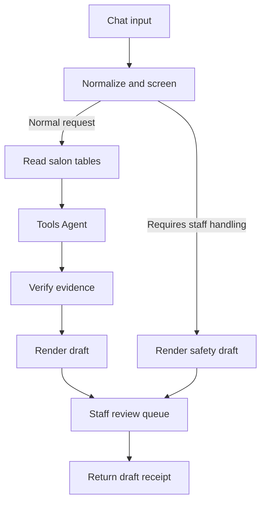

# Hair Salon Agent

n8n workflows for an English/Chinese hair salon assistant: service and price enquiries, promotions, hairstyle classification, stylist matching, and appointment conversations. The repository includes several prototypes, a self-hosted Docker Compose stack, mock salon data, and workflow generators and checks.

The **v3 workflow runs in internal shadow mode**: it prepares evidence-backed drafts for staff review. Its booking and hair-profile backends are not connected, so it does not confirm appointments or save customer profiles.

## Workflows and repository layout

| Location | Purpose |
| --- | --- |
| [`Main Workflow.json`](Main%20Workflow.json) | Chat entry point and unfinished router for the original demo sub-workflows. |
| [`Appointment.json`](Appointment.json) | Demo appointment conversation and booking-table integration. |
| [`Stylist.json`](Stylist.json) | Hairstyle and stylist recommendation demo. |
| [`Hair Design.json`](Hair%20Design.json) | Standalone photo-upload form and hairstyle recommendation demo. |
| [`salon_ai_workflow_todos.md`](salon_ai_workflow_todos.md) | Integration plan for the original demo workflows. |
| [`n8n_v2/`](n8n_v2/) | Docker deployment, mock data, and the v2 conversation-agent export. |
| [`n8n_v2/salon-assistant/`](n8n_v2/salon-assistant/) | v2 JavaScript sources, builder, table definitions, and test scripts. |
| [`n8n_v2/n8n_v3/`](n8n_v2/n8n_v3/) | v3 workflow sources, Python generators, validators, and import runbook. |

These are separate prototypes. The root photo workflow is not part of v3, and importing v3 does not connect the original demo sub-workflows. Older exports contain instance-specific credential, table, and workflow references that must be rebound after import.

The root demos use DeepSeek credentials; `Hair Design.json` also uses OpenAI for image analysis. `Appointment.json` inserts confirmed rows into a demo booking table without availability, conflict, or idempotency checks. A production booking backend remains integration work.

## How v3 works

The model selects an intent and IDs returned by tools. A separate guardrail checks those IDs against the current turn's evidence, and deterministic code renders the reply. Prices, promotions, and stylist claims come from salon data rather than model-written prose.



The 11 tools cover the service catalogue, promotions, style classification, stylist matching, hair profiles, booking steps, and staff escalation. In v3, booking and profile operations return an explicit unconfigured-backend response. Health concerns, complaints, refunds, and bargaining are routed for staff handling. v3 does not process photos.

## Quick start: self-hosted v3

### Prerequisites

- Docker with Docker Compose.
- Python 3.10+ and Node.js 18+ for generation and offline checks.
- An OpenAI or compatible model credential configured in n8n, with a model that supports tool calling.

The environment templates pin n8n and its task runners to `2.37.10`. The Compose stack also includes SearXNG and the n8n AI sandbox services.

### 1. Configure and start the stack

```bash
git clone git@github.com:s2164908/HairSalon_Agent.git
cd HairSalon_Agent/n8n_v2/n8n_v3
cp .env.example .env
```

Edit `.env` and replace every `CHANGE_ME_*` value with a generated secret. You can generate a value with `openssl rand -hex 32`. Variables with the same placeholder must receive the same value, since the API and runner sides authenticate each other.

Then start the services:

```bash
docker compose up -d
docker compose ps
```

Open [http://localhost:5678](http://localhost:5678) and complete the n8n owner setup. Only port `5678` is published by this stack; the sandbox and runner services stay on the Compose network. The sandbox runner uses privileged Docker-in-Docker.

### 2. Create the salon Data Tables

Create these tables in n8n with the exact names below:

| Table | Used for |
| --- | --- |
| `salon_services` | Active services, prices, currency, and duration. |
| `salon_promotions` | Promotion dates, channels, eligibility, and discounts. |
| `salon_stylists` | Active stylists, specialties, languages, and price tiers. |
| `salon_style_taxonomy` | Controlled hairstyle IDs and aliases. |
| `salon_review_queue` | Draft replies, escalation reasons, and guardrail results. |

Use [`n8n_v2/salon-assistant/tables.json`](n8n_v2/salon-assistant/tables.json) for column types and example rows for these tables. Array and object fields such as `specialties`, `eligibility`, and `discount` are stored as JSON strings. The review queue needs at least `session_id`, `request_text`, `draft_reply`, `reason`, `status`, and `guardrail_pass`; start with no rows.

All supplied salon data is fictional. The fixtures use AUD and `Australia/Sydney`, and some promotions have fixed expiry dates. Replace the catalogue and date-sensitive fixtures for your own testing or deployment.

### 3. Import and configure the workflows

From the v3 deployment directory, import these files through **Workflows → Import from File**, in this order:

1. `workflows/salon-assistant-error-handler.json`
2. `workflows/salon-assistant-v3.json`

In the main workflow:

- Select your model credential on **Model: replaceable**.
- Set **Settings → Error Workflow** to **Salon Assistant - Error Handler**.
- Confirm that the five Data Table nodes resolve to your local tables.
- Keep the workflow inactive while testing it in the editor; activate it after checking the drafts, queue writes, and error handling.

The exports do not bundle model credentials. Workflow IDs are assigned by your n8n instance after import. The optional `scripts/wire_workflows.py` helper can prepare a locally wired copy; see the [v3 import runbook](n8n_v2/n8n_v3/docs/v3-workflow.md#import-runbook) for details.

v3 defaults to `gpt-4o-mini`. For a compatible gateway, configure its Base URL and credentials and select a model supported by that gateway.

## Development and validation

### v3

Run from `n8n_v2/n8n_v3`:

```bash
python3 scripts/validate_workflows.py
node scripts/audit_workflows.mjs
node scripts/verify_guardrail_split.mjs
```

The Python validator checks workflow structure, wiring, evidence rules, and JavaScript syntax when Node.js is available. The independent JavaScript audit checks the exported workflows. The guardrail comparison replays fixtures against the original v2 reference and the v3 split.

Edit the graph in `scripts/workflow_spec.py` and node/tool bodies in `workflows/assets/`, then regenerate the exports:

```bash
python3 scripts/generate_workflows.py
```

Re-run the checks after regeneration. Generated JSON should be changed through its sources.

### v2

The outer `n8n_v2/salon-assistant-v2.json` is built from `n8n_v2/salon-assistant/`. It includes conversation state and availability logic; it differs from the older v2 snapshot inside `n8n_v3/`.

Run from `n8n_v2/salon-assistant`:

```bash
node build.js
node verify.js
node verify2.js
```

`node make_tables.js` regenerates `tables.json` from the mock data. Live scripts such as `run_chat.js` and `run_conversations.js` need a running n8n instance, imported workflows, credentials, tables, and the correct webhook URL. Their checked-in endpoints refer to the original local setup; update them before running against another instance.

### Known validation issues

The current snapshot has two known offline-check failures:

- `verify_guardrail_split.mjs` cannot compile `workflows/assets/code/_v2-validate-reference.js`, which contains an invalid reference payload.
- The v2 `verify.js` booking-overlap fixture hard-codes `+10:00`; it can fail during Sydney daylight saving time, when the slot logic uses `+11:00`.

Offline checks do not prove live n8n imports, model calls, or booking integration. Check node availability, table resolution, and staff-review behaviour on your target instance.

## Configuration and project notes

Local `.env` files and the original `n8n_v3.zip` archive contain deployment secrets and are excluded from Git. Use the committed `.env.example` templates for a new installation. Keep credentials and instance-specific ID maps local. The `n8n-data` Docker volume stores workflows, credentials, and the n8n database.

- [v3 architecture and import runbook](n8n_v2/n8n_v3/docs/v3-workflow.md)
- [v3 design plan](n8n_v2/n8n_v3/PLAN.md)
- [v2 design and local findings](n8n_v2/PLAN.md)
- [v2 build and test notes](n8n_v2/salon-assistant/README.md)
- [Deployment architecture](n8n_v2/CLAUDE.md)
