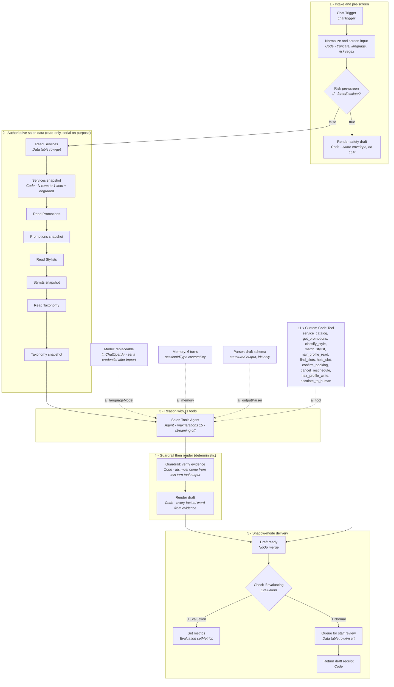
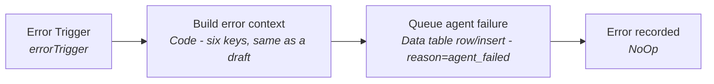
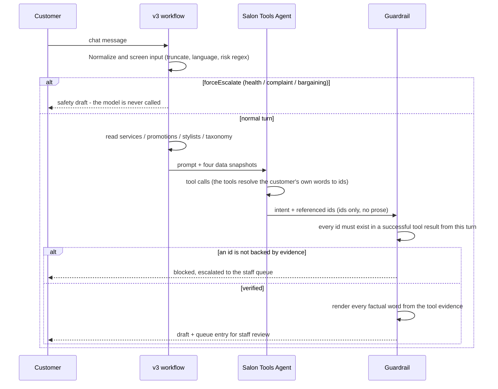

# v3 workflow — design, regeneration and import runbook

`salon-assistant-v2.json` is left untouched. Everything below produces and explains
`workflows/salon-assistant-v3.json` and `workflows/salon-assistant-error-handler.json`.

## What changed, and the evidence for each change

| # | v2 | v3 | Why |
|---|---|---|---|
| 1 | `maxIterations: 8` | `15` | `run2_output.md` records a 9-tool turn (`[promo_expired]`, 180 s) being silently truncated at the cap, so a *promotions* question answered with a *booking* message. `PLAN.md §10` warns about this. |
| 2 | Cloud `__aiGatewayManaged` credential (`id: null`) | no credential emitted | That credential only resolves on n8n Cloud; on this self-hosted stack the agent cannot run at all. Credentials never travel in an export (`PLAN.md §9`). |
| 3 | no error workflow | `salon-assistant-error-handler.json` + `settings.errorWorkflow` | A throw in any Code node killed the chat turn and the draft vanished with the execution. `PLAN.md` Phase 9 requires an Error Trigger. |
| 4 | one 189-line `Validate evidence and render draft` | `Guardrail: verify evidence` + `Render draft` | `PLAN.md §4/§5`: the guardrail must be an independent node, not a prompt. Splitting it also puts it on the canvas where it can be seen. |
| 5 | bypass path hand-built its own output envelope | both paths emit the identical envelope | v2's copy had already drifted — its `metrics` block omitted `tool_failures`, so the same queue column alternated between 8 and 7 keys. |
| 6 | `Queue for staff review` had no `resource`/`operation` | `resource: "row"`, `operation: "insert"` | v2 rode the node defaults (`row`/`insert`). Works today; breaks the day a default changes. |
| 7 | tables addressed by Cloud instance ids (`m7OzE8m6hDvMdeZ7`…) | addressed by **name** (`mode: "name"`) | Instance ids do not exist on this stack. Name addressing is what makes one JSON importable on both (`PLAN.md §1 #8`, `§9`). |
| 8 | memory keyed implicitly (`fromInput`) | `sessionIdType: customKey` + explicit expression | v2's memory only worked because four Snapshot nodes happened to spread `...ctx` forward. |
| 9 | language = bare `/[CJK]/` test | script-ratio comparison | "I want the 波波头 look" set `language: zh` and rendered the whole English draft in Chinese. |
| 10 | no sticky notes, inconsistent names | 7 sticky notes, 4 canvas groups, one naming scheme | The load-bearing rules lived only in the system message. |
| 11 | no Evaluation wiring | `Check if evaluating` → `Set metrics` | `PLAN.md §4/§6` Phase 6, and the v2 node's own comment asked for it. |
| 12 | no retries on table reads | `retryOnFail` on all four reads | One transient blip currently degrades the whole catalogue for that turn. |

## Main workflow



### Why the read chain stays serial

`n8n >= 1.0` runs a node's outgoing branches **one at a time** — "executes each branch
in turn, completing one branch before starting another". Fanning the four reads out to
a Merge node would therefore be no faster, and each `Snapshot` node does real work that
cannot move into the Merge: collapse N rows to **1 item**, tag the table, and compute
`degraded`. One item is the contract because an n8n sub-node expression always resolves
the first item (`PLAN.md §10`).

## Error workflow



It writes into the **same** `salon_review_queue` table with the same six columns, so
triaging a failure needs no second place to look. It deliberately has **no**
`errorWorkflow` of its own: a failure while recording a failure must stop, not loop.
`wire_workflows.py` asserts that before it writes anything.

## One turn, end to end



## Files

```
scripts/
  extract_v2_assets.py       one-off: v2 -> workflows/assets/ (reproducible, audited)
  workflow_spec.py           the graph as data: nodes, edges, groups, sticky notes
  generate_workflows.py      spec + assets -> workflows/*.json
  validate_workflows.py      structure + invariants (44 checks)
  audit_workflows.mjs        the same questions asked again in JS (independent impl)
  verify_guardrail_split.mjs proves the guardrail split changed no behaviour
  wire_workflows.py          post-import: settings.errorWorkflow + credential
workflows/
  assets/code/*.js           Code-node bodies (reviewable, syntax-checkable)
  assets/tools/*.js          the 11 tuned tool bodies
  assets/tools/*.description.txt
  assets/agent-system-message.txt
  assets/draft-schema.json   structured-output schema
  assets/tool-input-schemas.json
  salon-assistant-v3.json            <- import this
  salon-assistant-error-handler.json <- import this, then wire it
docs/v3-workflow.md          this file
```

## Regenerate and verify

```bash
python3 scripts/generate_workflows.py        # spec + assets -> the two .json files
python3 scripts/validate_workflows.py        # 44 structure + invariant checks
node    scripts/audit_workflows.mjs          # the same questions, second implementation
node    scripts/verify_guardrail_split.mjs   # 29 fixtures, v2 node vs v3 pair
```

All four exit non-zero on failure. `verify_guardrail_split.mjs` is the important one:
it compiles the **original** v2 node body out of
`workflows/assets/code/_v2-validate-reference.js`, compiles the v3 pair, replays every
fixture through both and deep-compares the emitted envelopes. It has been mutation-tested
— deleting `\u007f` from the sanitiser, or changing one word of the price line, both
make it fail.

`validate_workflows.py` checks, among others:

- the connection shape `{node: {outputType: [[edge]]}}`, and that nothing is nested twice
  (a double-nested connection is valid JSON and drops **every** edge on import, silently)
- **every `$('Node name')` expression resolves to a real node.** This is how the refactor
  caught itself: the cosmetic rename of the snapshot nodes broke 6 references held by the
  tuned tool bodies, which n8n would only have reported at runtime.
- the 11 tool node names match both `workflow_spec.TOOLS` and the `TOOLS:` line in the
  agent's system message — for a Custom Code Tool the node name **is** the LLM's tool name
- the agent's system message and all 11 tools' `jsCode` / `description` / `inputSchema`
  are **byte-identical** to v2
- the five carried snapshot/receipt Code bodies are byte-identical to v2
- both render paths emit the same 13-key envelope with all 8 metrics
- `maxIterations >= len(TOOLS)`, streaming off, intermediate steps on
- IF / Switch outputs go to the intended branches (0 = safety bypass / evaluation,
  1 = normal)
- no `__aiGatewayManaged` credential anywhere; every Data Table node has an explicit
  `resource` + `operation` and addresses its table by name
- no sticky note overlaps a node; every canvas group id resolves
- `node --check` on every Code node

## Import runbook

1. Start the stack (`docker compose up -d`), open http://localhost:5678.
2. **Workflows → Import from File** → `workflows/salon-assistant-error-handler.json`,
   then `workflows/salon-assistant-v3.json`. Both import as **new** workflows: the
   generated files deliberately carry no `id`, `versionId` or `meta.instanceId`, so
   importing v3 does not overwrite your existing v2 workflow and you can A/B the two.
3. **Set the error workflow.** Open each new workflow → the three-dot menu →
   *Settings* → *Error Workflow* → `Salon Assistant - Error Handler`.
   Or let the script do it:
   ```bash
   N8N_BASE_URL=http://localhost:5678 N8N_API_KEY=... \
     python3 scripts/wire_workflows.py --from-api --credential "<your OpenAI credential name>"
   ```
   Without an API key, write `workflows/workflow_ids.json` by hand from the two
   workflow URLs and run `python3 scripts/wire_workflows.py --ids workflows/workflow_ids.json --in-place`.
   (Do not commit that file.)
4. **Attach the model credential.** Open `Model: replaceable` and pick an OpenAI (or
   OpenAI-compatible) credential. This is the one step that cannot be scripted from a
   file — the v2 gateway credential only exists on n8n Cloud. Per `PLAN.md §7`, point
   *Base URL* at a gateway for OpenRouter / LiteLLM / Ollama.
5. **Create the five Data Tables** with these exact names, since the nodes address them
   by name (`mockdata.jsonc` has the content):

   | Table | Columns the workflow reads |
   |---|---|
   | `salon_services` | `service_id`, `name`, `name_zh`, `price`, `currency`, `duration_min`, `active` |
   | `salon_promotions` | `promotion_id`, `title`, `everyone`, `valid_from`, `valid_to`, … |
   | `salon_stylists` | `stylist_id`, `name`, `specialties`, `languages`, `price_tier`, `active` |
   | `salon_style_taxonomy` | `taxonomy_id`, `name_en`, `name_zh`, `aliases` |
   | `salon_review_queue` | `session_id`, `request_text`, `draft_reply`, `reason`, `status`, `guardrail_pass` |

   `salon_review_queue` is the only table the workflow **writes**. If it is missing the
   write fails, and `Return draft receipt` says so loudly rather than pretending the
   draft was recorded.
6. **Re-run the 18 cases** from `run2_output.md` and confirm `[promo_expired]` no longer
   truncates at the iteration cap.
7. Leave the workflow **inactive** until you have run those cases. `Queue for staff
   review` is the only sink, so shadow mode is safe, but do not activate it before the
   credential and tables resolve.

## Deliberate deviations from the reviewed plan

Two, both to avoid breaking working code:

1. **Five node names were NOT changed.** `Normalize and screen input`,
   `Services snapshot`, `Promotions snapshot`, `Stylists snapshot` and
   `Taxonomy snapshot` keep v2's names. The tuned tool bodies call them by name
   (`$('Services snapshot')`), and n8n resolves that at runtime — so renaming them
   breaks tool calling with no error at the rename site. Renaming the rest of the
   graph was enough to make the canvas readable. `validate_workflows.py` now enforces
   this: it resolves every `$('...')` reference and fails if one dangles.
2. **`tags` is emitted as `[]`.** n8n resolves tag references by name at import, and
   an unresolvable tag can fail the import. Rather than risk the file, tag the
   workflows in the UI (suggested: `salon`, `shadow-mode`, `ai-agent`), or pass tags
   through the API in a later `wire_workflows.py` iteration.
3. **`settings.availableInMCP: true` is carried over from v2, not re-decided.**
   `build_workflow()` in generate_workflows.py writes v2's settings verbatim so nothing
   changes behind your back — but this flag exposes the workflow to whatever MCP client
   is connected to the instance. For a workflow that drafts customer replies you may
   want it off. It is one boolean in that function.

## What could not be verified here

Docker is not installed in this environment (`docker: command not found`), so nothing
below was proven on a live n8n instance:

- that the import renders as intended (node types, canvas groups, sticky notes)
- that `n8n-nodes-base.evaluation` typeVersion `4.8` is the version your `2.37.10`
  image ships, and that `checkIfEvaluating` takes the **Normal** branch when no
  Evaluation Trigger is present. Both were read off
  `Evaluation.node.ee.ts` / `evaluationUtils.ts`
  (`checkIfEvaluating()` returns `[inputData, []]` only when an Evaluation Trigger is
  an ancestor) and off the published `n8n-nodes-base` package, which does ship
  `Evaluation.node.ee.js` — but they are not runtime-verified.
- that the Data Table `mode: "name"` locator resolves on your instance
- the **sticky-note `color` values** (numeric `1`–`7`). The Note node is defined in the
  editor UI rather than `nodes-base`, so the parameter could not be read from source.
  If the numbers are wrong the notes simply render in the default colour — it is
  cosmetic only and nothing in the workflow reads it. Recolour them from the canvas in
  a few seconds if you care.
- end-to-end behaviour against a real model

Run the checklist in *Regenerate and verify*, then do the import runbook and treat step 6
as the acceptance test. If `Check if evaluating` or `Set metrics` shows an unknown-node
warning, delete those two nodes plus the `Draft ready → Check if evaluating` edge and
wire `Draft ready → Queue for staff review` directly — the live path does not depend on
them.

## Next (PLAN.md Phase 6)

`Set metrics` is wired and inert until you add an Evaluation Trigger. The dataset to
start from is the 18 cases recorded in `run2_output.md`; the metric names already
emitted are the ones in `PLAN.md §6`'s table (`hallucination_blocked` is
`hallucination_rate = 0`, `escalated` feeds the over/under-escalation rates, and
`tool_call_count` is the cost proxy).


