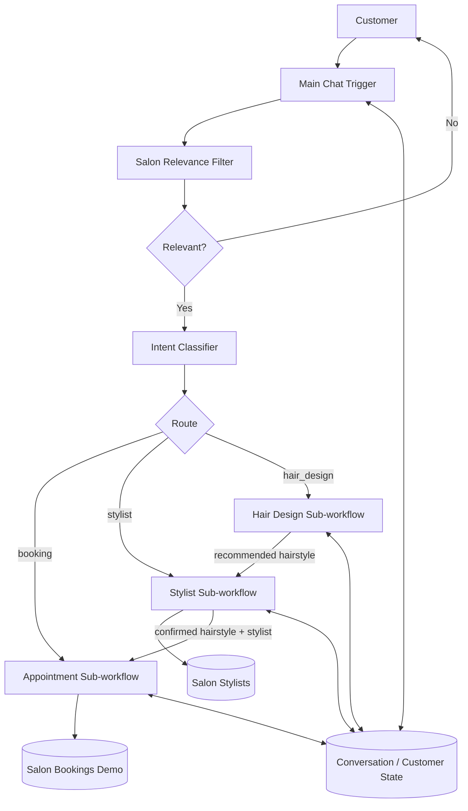

# Salon AI Workflow Implementation TODO

## 1. Goal

Implement the unfinished **main salon customer-service workflow** and integrate the existing sub-workflows into one stateful n8n system.

The current project contains:

- **Main Workflow / Salon Appointment**
  - Chat entry point
  - Salon relevance filter
  - Incomplete classifier/router
  - Existing calls to:
    - Appointment sub-workflow
    - Stylist sub-workflow
  - A third intended route for customized hairstyle design, but it is not connected yet

- **Appointment**
  - Collects:
    - customer name
    - email
    - phone
    - service
    - preferred date
    - preferred time
  - Uses memory
  - Saves completed bookings into `Salon Bookings Demo`

- **Stylist**
  - Loads active stylists from `Salon Stylists`
  - Helps customer decide on a hairstyle
  - Matches the hairstyle to a roster stylist
  - Uses memory
  - Returns:
    - `hairstyle`
    - `stylist`
    - `reply`

- **Hair Design / Salon Style**
  - Takes a customer photo
  - Uses image analysis to validate the photo
  - Extracts styling-relevant features
  - Generates 2–3 hairstyle recommendations
  - Currently runs as a standalone form workflow and is not callable as a sub-workflow

---

# 2. Target Architecture

---

